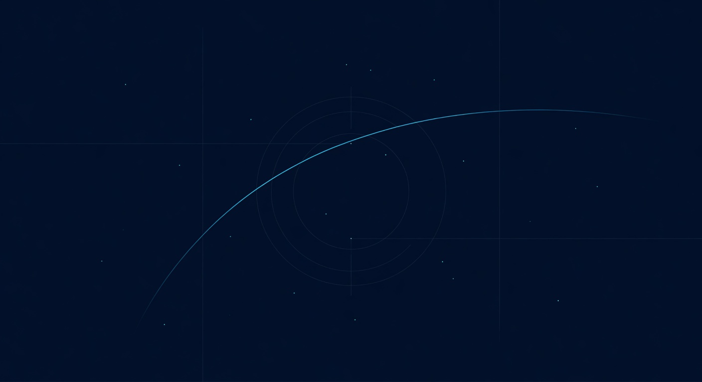
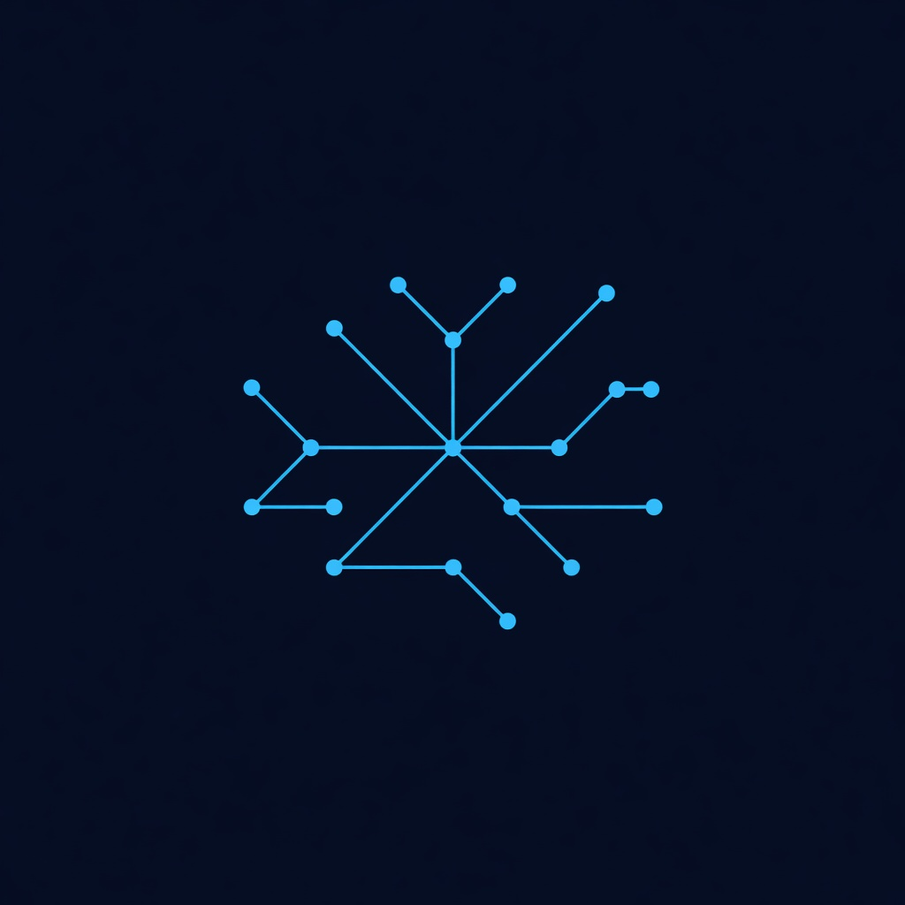
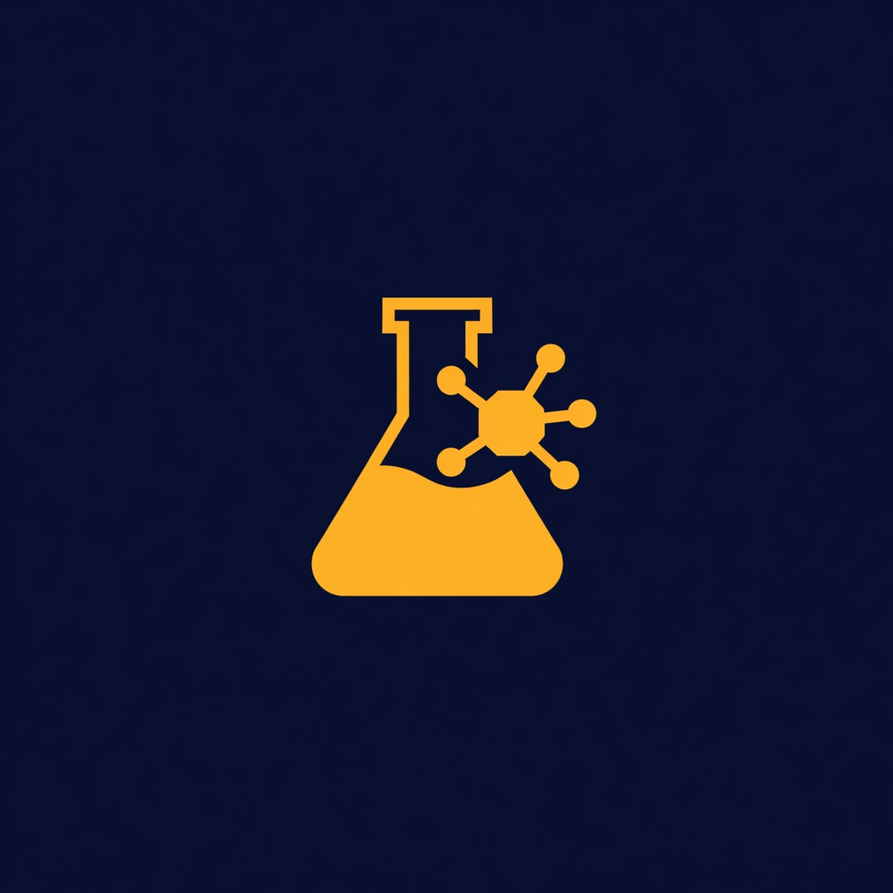
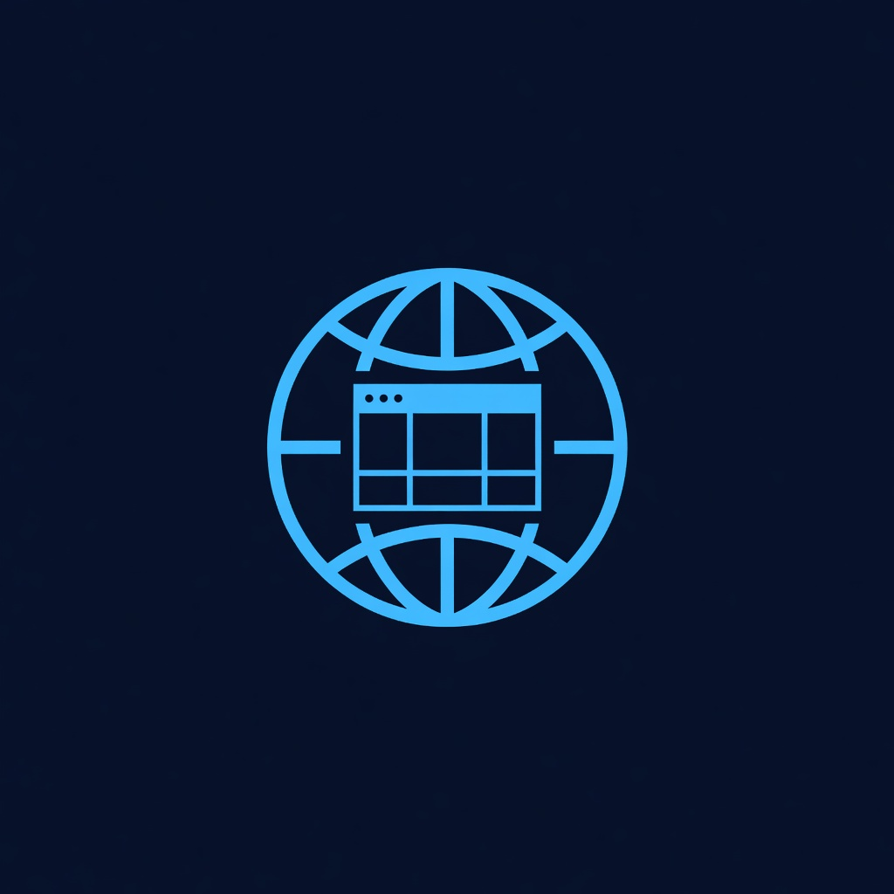
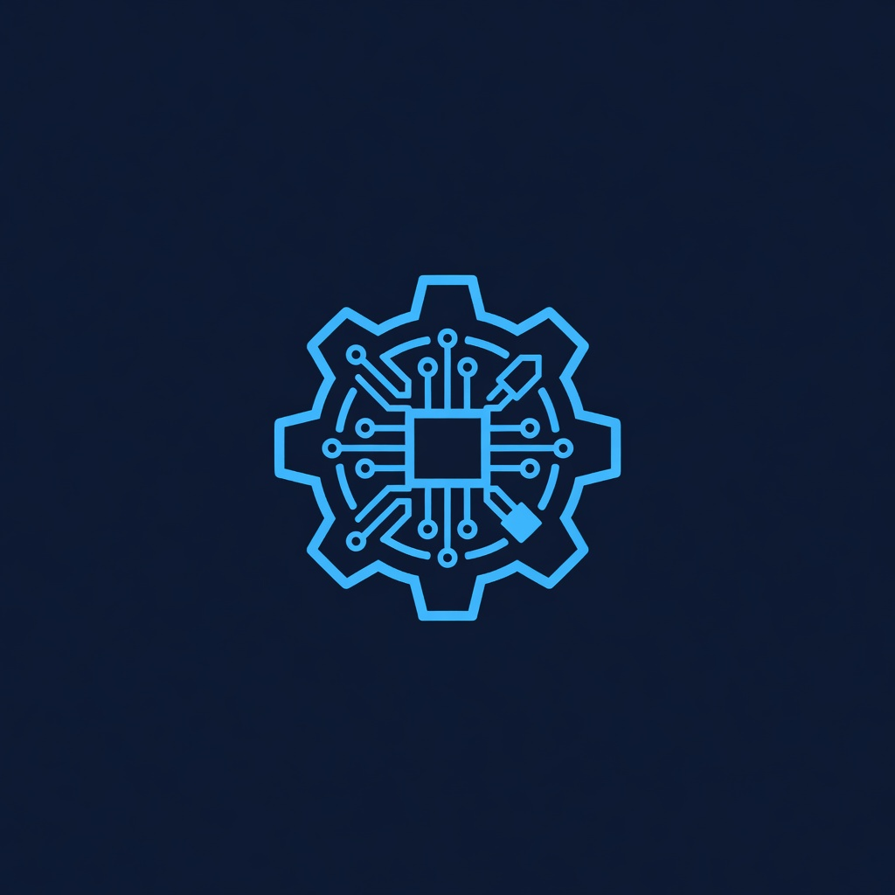

  

<h1 align="center">Aiden Kim</h1>

  

  
  
  
  

  
  
  
  

  
  
  
  
  
  
  
  
  
  
  

---

## About

Aerospace engineer from Busan, now based in Daejeon. Graduated **Busan Science High School (부산과학고, 17기)**. Entered KAIST in 2022 and declared **Aerospace Engineering** in 2023.

Alongside the degree, I've led and been part of student organizations at KAIST: **Freshman Student Council** (2022, design & planning), **Vice President of Silver Lining** (2023) — registered as 정동아리, nearly the first international-focused student club at KAIST to earn official recognition — and **President of ASCEND** (2024–2025), the international sports club, which became KAIST's fastest-growing and largest student organization during my term.

I work across aerospace engineering, ML research, and agent infrastructure. Current focus is on guidance and control, token-efficient agent systems, and the startup.

---

## Currently

### Pathtent

 &nbsp; *Pre-launch B2B SaaS*

Patents without the pain. Pathtent drafts specification documents alongside you and surfaces the closest prior art, replacing KIPRIS-dependent workflows with a purpose-built database.

### Airbus Fly Your Ideas

 &nbsp; *Submission end of May 2026*

*In Vitro Firmware Red-Teaming* — autonomous firmware verification pipeline for aerospace supply-chain security. Competing for one of three global finalist slots. Mentored by Prof. Yongdae Kim (KAIST SSL).

### KAIST Aerospace Engineering

 &nbsp; *5th year, on semester leave · Class of 2026*

Splitting time across aerospace, ML, and agent infrastructure.

---

## Featured Work

###  Agent Infrastructure

<table cellpadding="10" cellspacing="0" border="0">
<tr>
<td width="50%" valign="top">

**[recall](https://github.com/AidenGeunGeun/recall)**  
`TypeScript` · Semantic memory for AI agents. Cross-session continuity without bloating context.

</td>
<td width="50%" valign="top">

**[transcribe-cli](https://github.com/AidenGeunGeun/transcribe-cli)**  
`TypeScript` · Local document-to-markdown OCR for PDFs, DOCX, images, and more.

</td>
</tr>
<tr>
<td width="50%" valign="top">

**[code-intel](https://github.com/AidenGeunGeun/code-intel)**  
`TypeScript` · Lightweight code intelligence and navigation for agent workflows.

</td>
<td width="50%" valign="top">

**[exa-cli](https://github.com/AidenGeunGeun/exa-cli)**  
`TypeScript` · Three-tier web research via the Exa Search API for agents.

</td>
</tr>
<tr>
<td width="50%" valign="top">

**[todoist-cli](https://github.com/AidenGeunGeun/todoist-cli)**  
`TypeScript` · JSON-first Todoist CLI for agent task and project workflows.

</td>
<td width="50%" valign="top">

**[OpencodeOrchestra](https://github.com/AidenGeunGeun/OpencodeOrchestra)**  
`TypeScript` · Multi-layer agent orchestration. PM plans, specialists execute.

</td>
</tr>
<tr>
<td width="50%" valign="top">

**[opencode-context-compress](https://github.com/AidenGeunGeun/opencode-context-compress)**  
`TypeScript` · Manual-first context compression. You own the when.

</td>
<td width="50%" valign="top">

**[the-hive](https://github.com/AidenGeunGeun/the-hive)**  
`TypeScript` · Swarm coordination layer for multi-agent task execution.

</td>
</tr>
<tr>
<td width="50%" valign="top">

**[image-gen](https://github.com/AidenGeunGeun/image-gen)**  
`TypeScript` · JSON-in/JSON-out image generation CLI for agents.  
[GitHub](https://github.com/AidenGeunGeun/image-gen) · [npm](https://www.npmjs.com/package/@skybluejacket/image-gen)

</td>
<td width="50%"></td>
</tr>
</table>

---

###  Research & Experiments

<table cellpadding="10" cellspacing="0" border="0">
<tr>
<td width="50%" valign="top">

**[thinking-token](https://github.com/AidenGeunGeun/thinking-token)**  
`TypeScript` · Token budget reasoning and introspection for LLM agents.

</td>
<td width="50%"></td>
</tr>
</table>

---

###  Web Apps

<table cellpadding="10" cellspacing="0" border="0">
<tr>
<td width="50%" valign="top">

**[GraduateKAIST](https://github.com/AidenGeunGeun/GraduateKAIST)**  
`TypeScript` · [graduatekaist.vercel.app](https://graduatekaist.vercel.app) — KAIST graduation planning tool.

</td>
<td width="50%"></td>
</tr>
</table>

---

###  Systems & Exploration

<table cellpadding="10" cellspacing="0" border="0">
<tr>
<td width="50%" valign="top">

**[blue-pcbang-dropship](https://github.com/AidenGeunGeun/blue-pcbang-dropship)**  
`Python` · Automated dropship workflow system built for a specific market.

</td>
<td width="50%" valign="top">

**[ZoomToText](https://github.com/AidenGeunGeun/ZoomToText)**  
`Python` · Real-time Zoom audio transcription and text extraction pipeline.

</td>
</tr>
</table>

---

###  Aerospace

<table cellpadding="10" cellspacing="0" border="0">
<tr>
<td width="50%" valign="top">

**[PINN_Guidance](https://github.com/AidenGeunGeun/PINN_Guidance)**  
`Python` · Physics-informed neural networks for missile guidance.

</td>
<td width="50%" valign="top">

**[hvt-missile-sim](https://github.com/AidenGeunGeun/hvt-missile-sim)**  
`Python` · High-value target missile engagement simulation.

</td>
</tr>
<tr>
<td width="50%" valign="top">

**[6dofsim](https://github.com/AidenGeunGeun/6dofsim)**  
`MATLAB` · Six-degree-of-freedom flight dynamics simulator.

</td>
<td width="50%" valign="top">

**[Coop_guidance](https://github.com/AidenGeunGeun/Coop_guidance)**  
`MATLAB` · Cooperative guidance law design and analysis.

</td>
</tr>
</table>

*Archive: [9M723-Iskander-missile-trajectory](https://github.com/AidenGeunGeun/9M723-Iskander-missile-trajectory) — preserved copy of a deleted repo with solid 6-DOF aeroballistic modeling. Kept for reference, not authored by me.*

---

## Research

<table cellpadding="10" cellspacing="0" border="0">
<tr><td>

**KAIST Flight Dynamics and Control Lab (FDCL)** &nbsp;·&nbsp; Prof. Chang Hoon Lee &nbsp;·&nbsp; 2024–2025

One-year individual study and paid research. Collaborated on air-to-air missile **range estimation** — real-time on-board computation of the no-escape zone for HUD rendering. Hit **60 Hz with high fidelity** on compute-constrained cockpit hardware.

*Actively looking for more KAIST lab opportunities at the aerospace / CS intersection.*

</td></tr>
</table>

<table cellpadding="10" cellspacing="0" border="0">
<tr><td>

**Undergraduate Research — PINNs for Aerospace Applications** &nbsp;·&nbsp; 2024–2025

Physics-informed neural networks for guidance and trajectory estimation. Parallel track to the FDCL work.

</td></tr>
</table>

---

## Background

<table cellpadding="10" cellspacing="0" border="0">
<tr><td>

<kbd>B.S. Aerospace Engineering · KAIST · 2021–2026 · 5th year, on semester leave</kbd>

| Year | |
|:---|:---|
| **2026–** | CTO, **Pathtent** |
| 2025 | **Hanwha Aerospace Special Award** — ROK Air Force Academy Academic Conference |
| 2024–Early 2026 | **FDCL, KAIST** — individual study + paid researcher under Prof. Chang Hoon Lee |
| 2024–Early 2026 | **Undergraduate Research** — PINNs for aerospace applications |
| **2026** | **Airbus Fly Your Ideas — Phase 2**, competing for finalist |

</td></tr>
</table>

---

## Activity

  <picture>
    <source media="(prefers-color-scheme: dark)" srcset="https://raw.githubusercontent.com/AidenGeunGeun/AidenGeunGeun/output/github-contribution-grid-snake-dark.svg">
    <source media="(prefers-color-scheme: light)" srcset="https://raw.githubusercontent.com/AidenGeunGeun/AidenGeunGeun/output/github-contribution-grid-snake.svg">
    
  </picture>

  

  

