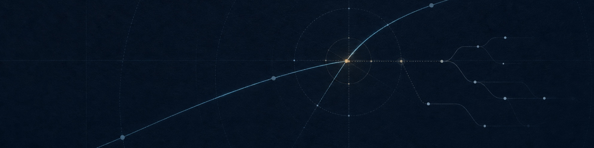

  

<h1 align="center">Aiden Kim</h1>

  KAIST Aerospace Engineering · MLAI Lab · Agent Infrastructure

  <a href="https://aidengeungeun.github.io">Website</a> ·
  <a href="mailto:skybluejacket@kaist.ac.kr">Email</a> ·
  <a href="https://x.com/VibeCodeAiden">X</a>

I work across ML systems, tools for AI agents, and aerospace guidance and control. I am an Aerospace Engineering undergraduate at KAIST, expected to graduate in February 2028.

## Now & recent

- **[KAIST MLAI Lab](https://www.mlai-kaist.com/)** — Undergraduate researcher / intern under Prof. Sung Ju Hwang, working on heterogeneous LLM serving across GPU and Apple Silicon systems.
- **Pathtent** — Co-founder & CTO, building a patent drafting and prior-art platform.
- **Airbus Fly Your Ideas** — Led *In Vitro Firmware Red-Teaming*. We reached Phase 2—top 50 of approximately 400 global teams—and did not advance to the three-team final.

## Selected work

- **[recall](https://github.com/AidenGeunGeun/recall)** — Semantic memory for AI agents without carrying full session history.
- **[transcribe-cli](https://github.com/AidenGeunGeun/transcribe-cli)** — Local document-to-Markdown extraction for PDFs, Office files, images, and more.
- **[code-intel](https://github.com/AidenGeunGeun/code-intel)** — Lightweight code navigation and intelligence for agent workflows.
- **[opencode-context-compress](https://github.com/AidenGeunGeun/opencode-context-compress)** — User-controlled context compression for long-running OpenCode sessions.
- **[GraduateKAIST](https://github.com/AidenGeunGeun/GraduateKAIST)** — Private, client-side graduation planning for KAIST students.
- **[PINN_Guidance](https://github.com/AidenGeunGeun/PINN_Guidance)** — Physics-informed neural networks for real-time aerospace guidance.

[See the full project index →](https://aidengeungeun.github.io/#projects)

## Research

- **Heterogeneous LLM serving** · [KAIST MLAI Lab](https://www.mlai-kaist.com/) · 2026—present

  CUDA prefill → MLX decode disaggregation in SGLang, with current work on serving correctness and end-to-end latency/energy evidence.

- **Long-context attention behavior** · 2026

  Pilot experiments around RoPE degradation, attention sinks, and position addressability.

- **Agentic completion reliability** · 2026

  Studying whether intent-grounded, trajectory-aware stop gates can reduce false completion in long-horizon coding agents.

- **Aerospace guidance** · 2024—2026

  Missile range estimation, cooperative interception, and PINN-based trajectory generation; the PINN track is currently on hold.

  Busan → Daejeon · KAIST Aerospace Engineering

